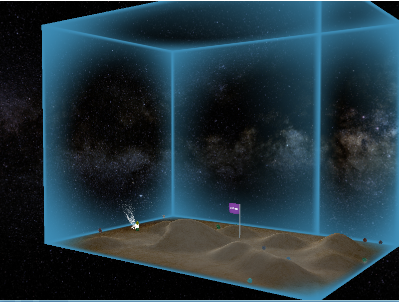

###桌球demo  
####2015年图形学大作业  
 
该项目是图形学的大作业，原本是要做桌球游戏。但是由于3次迭代要求改动太多，已经不是一个游戏了。。  
主要实现的效果:  
1.包围盒以及高低起伏的地形。  
2.小球飞行和跳跃时的粒子效果。  
3.飘动的旗帜。  
4.全局光照和聚光灯。  
5.用perlin算法生成的小球纹理。  

####使用的技术  
使用的图形库为opengl。使用了glut库来显示窗口和接受输入。小球和地形的物理碰撞效果使用了physx物理引擎来模拟。

####操作说明  
1.鼠标控制摄像机旋转
2.W,A,S,D 控制摄像机移动
3.esc键解除鼠标锁定
4.↑↓←→控制白球移动
5.z键控制白球跳跃

####截图  

